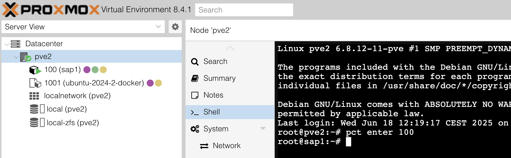

################################
  Set up Proxmox as Hypervisor
################################

****************
  Introduction
****************

Going forward I will shorten 'Proxmox Virtual Environment' to 'PVE' or 'pve'.

https://www.proxmox.com/

.. note::

  | PVE is licensed per CPU socket.
  | There is a free tier with only community support and without the enterprise grade components.
  |

You can find more information and offical documentation here:

- Proxmox VE Documentation - https://pve.proxmox.com/pve-docs/index.html
- Proxmox Support Forum    - https://forum.proxmox.com/
- Proxmox Wiki             - https://pve.proxmox.com/wiki/Main_Page

| A collection of very helpful scripts, which are trusted and highly regarded by the FOSS community.
| The author **tteck** has passed (https://github.com/tteck/Proxmox/discussions/4009) and the repository is archived.
|

- https://tteck.github.io/Proxmox/  - project home page
- https://github.com/tteck          - repository home     

.. warning::

  Be cautious and always inspect the source of public files!

***************
  Information
***************

Documents my *personal* setup.

.. note::

  | This is not intended for a productive environment!
  | Use at your own risk.
  |

Besides the web console there are other ways to manage a Proxmox cluster 
-- also with just one Node, which is very common.

- Ansible
- Proxmox API: https://pve.proxmox.com/wiki/Proxmox_VE_API

***************************************
  LXC Containers and Virtual Machines
***************************************

QEMU
====

Optionally install QEMU (only for VMs?).

From https://pve.proxmox.com/wiki/Qemu-guest-agent

  | The ``qemu-guest-agent`` is a helper daemon, which is installed in the guest. 
  | It is used to exchange information between the host and guest, and to execute command in the guest.
  |
  | In Proxmox VE, the ``qemu-guest-agent`` is used for mainly three things:
  |
  | 1. To properly shutdown the guest, instead of relying on ACPI commands or windows policies
  | 2. To freeze the guest file system when making a backup/snapshot (on windows, use the volume shadow copy service VSS). 
  |    If the guest agent is enabled and running, it calls ``guest-fsfreeze-freeze`` and ``guest-fsfreeze-thaw`` to improve consistency.
  | 3. In the phase when the guest (VM) is resumed after pause (for example after snapshot) it immediately synchronizes its time with the hypervisor using ``qemu-guest-agent`` (as first step).

.. code:: bash

  apt install qemu-guest-agent

Depending on status and system:

.. code:: bash

  systemctl status qemu-guest-agent

  systemctl start qemu-guest-agent

  systemctl enable qemu-guest-agent

Details for Windows can be found at https://pve.proxmox.com/wiki/Qemu-guest-agent

*************
  Templates
*************

Debian/Ubuntu

Optionally install CloudInit (only for VMs!).

.. code:: bash

  sudo apt install cloud-init

Reset SSH host keys

.. code:: bash
  
  cd /etc/ssh
  sudo rm ssh_host_*

Missing keys will trigger CloudInit (if installed) to create.

Machine dependencies

The "machine id" needs to be unique across both CTs and VMs.

.. code:: bash

  cat /etc/machine-id
    
  sudo truncate -s 0 /etc/machine-id

Also check symbolic link::

  /var/lib/dbus/machine-id

Create the symbolic link if missing

.. code:: bash

  sudo ln -s /etc/machine-id /var/lib/dbus/machine-id

Clean out package repositories

.. code:: bash

  sudo apt clean
  sudo apt autoremove

Shut down to make changes in PVE console

- Convert to Template
- Remove/eject CD ROM if present (VMs / ISO image)
- Optionally add CloudInit drive (if CloudInit is installed) 
- Enable QEMU if guest is installed
- Edit changes in CloudInit drive, e.g. user
- Click regenerate image

| Now ready for "Clone" Template
| Personal choice: Prefer full clone instead of "linked"

Update hostname
===============

Debian

.. code:: bash

  sudo nano /etc/hostname

  sudo nano /etc/hosts

Ubuntu

*******************
  Troubleshooting
*******************

Not showing console
===================

If the PVE web console does not show for a container (Debian).

Open the *Node* console (e.g. :code:`pve2`):

.. code:: bash

  pct enter vmid

For example: :code:`pct enter 100`.

From :code:`man pct`:::

  pct - Tool to manage Linux Containers (LXC) on Proxmox VE
